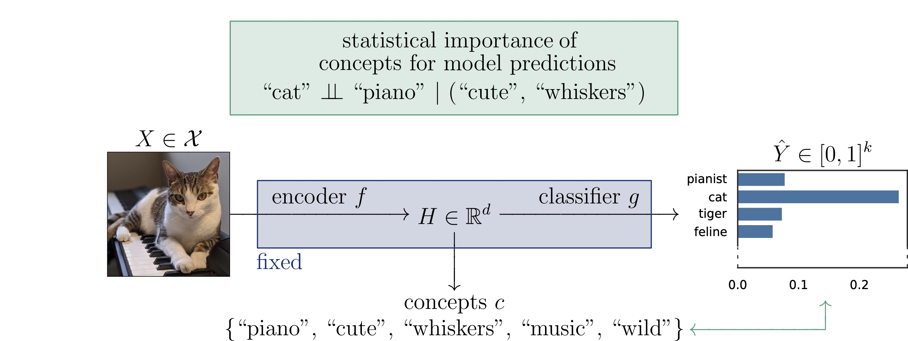

# I Bet You Did Not Mean That: Testing Semantic Importance via Betting

This is the official implementation of the paper [*I Bet You Did Not Mean That: Testing Semantic Importance via Betting*](https://arxiv.org/abs/2405.19146)

by [Jacopo Teneggi](https://jacopoteneggi.github.io) and [Jeremias Sulam](https://sites.google.com/view/jsulam).

---

